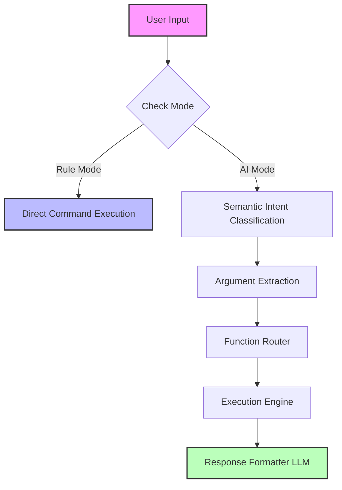

# Personalised Intelligent Shell (JaiShell)

  

> **A hybrid AI-assisted command execution system merging traditional shell behavior with modern machine-learning-driven intent understanding.**

---

## 📖 Overview

**Personalized Intelligent Shell** is designed as a **CONTROLLED** shell, not a chatbot. It strictly separates reasoning from execution. All commands are executed deterministically through verified functions, ensuring that Large Language Models (LLMs) are never allowed to directly execute commands.

### 🎯 Core Objectives
1.  **Natural Language Processing:** Convert natural language input into executable system commands.
2.  **Safety First:** Maintain strict separation between reasoning and execution to prevent hallucinations.
3.  **Deterministic Execution:** Support both rule-based and AI-assisted workflows.
4.  **Traceability:** Persist session history, commands, and errors.

---

## ⚙️ System Modes

Personalized Intelligent Shell operates in two distinct modes to balance control and flexibility.

| Mode | Description | Workflow | Examples |
| :--- | :--- | :--- | :--- |
| **RULE MODE** | Traditional shell-style interaction. | Keyword-based dispatch. Fully deterministic with **Zero ML/LLM involvement**. | `open chrome` `clean temp` `status` |
| **AI MODE** | Natural language interaction. | ML-based intent routing & schema-driven argument extraction. **LLM used only for response formatting.** | `clean the junk from my pc` `what's the weather in delhi?` `read the jai.pdf file` |

---

## 🏗️ Architecture

> **IMPORTANT:** LLMs **NEVER** execute commands. All outputs are structured and logged.

---

## 📥 Model Weights (Required)

To run the AI Mode effectively, you must download the fine-tuned embedding model `Finetuned-gte-large-en-v1.5`.

| Model Name | Download Link |
| :--- | :--- |
| **Finetuned-gte-large-en-v1.5** | [**📂 Download from Google Drive**](https://drive.google.com/file/d/1tnAGQwr1tUUYgTLwp6oLiTOB8oqCXfd2/view?usp=sharing) |

> *Please place the downloaded model folder in the root directory or update your configuration path accordingly.*

---

## 🧩 Core Components

* **CoreShell:** Main shell loop & input parsing. Handles mode switching and output rendering (typing effects).
* **AI Core:** Manages semantic intent mapping and argument extraction.
* **Function Router:** Acts as a safety gate, mapping intents to registered commands.
* **Command Contracts:** Enforces structured return values and standardizes error handling.
* **Database Layer:** Logs sessions, command history, and function embeddings.

---

## 🤖 Machine Learning Pipeline

1.  **Intent Classification**
    * Uses sentence embedding-based similarity.
    * Trained on curated prompt-function datasets to map `User Prompt` → `Function Name`.
2.  **Argument Extraction**
    * **Schema-aware parsing:** Uses token-based semantic extraction.
    * **Safety:** Prevents hallucinated arguments to ensure execution safety.
3.  **Response Generation**
    * Uses a lightweight LLM **exclusively** for formatting.
    * **Strict Rules:** No invented facts, no placeholders, max 1–2 sentences.

---

## 🚀 Roadmap & Future Updates

This project is under active development. The following features are planned for upcoming releases:

- [ ] **Advanced Intent Classification:** Improved routing logic for distinguishing chat vs. execution.
- [ ] **Enhanced Argument Extraction:** Implementation of **Regex-based extraction** for higher precision and speed.
- [ ] **External API Integrations:** Native support for:
    - [ ] News & Weather APIs
    - [ ] Financial Data
    - [ ] System Health Monitoring
- [ ] **Session Memory:** Context-aware command references.

---

## 🚫 What This Project Is NOT

* ❌ A Chatbot
* ❌ An Autonomous Agent
* ❌ A Shell Replacement
* ❌ A "Prompt-Execute" System

**This is an INTELLIGENT INTERFACE over controlled execution.**

---

## 👥 Target Audience
* Systems Programmers
* ML Engineers
* Backend Engineers
* Security-conscious Automation Developers

---

## 📌 Version & Author

**Current Version:** `0.2 (Rebuilt)`  
**Author:** Jai Saraswat
